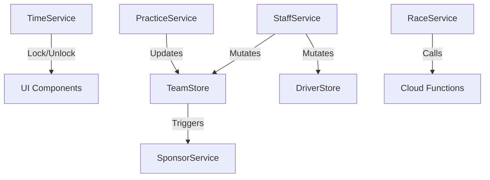

# AI Technical Specification: Service Registry & Interfaces

This document defines the interface and behaviors of core services for automated code generation and architectural reasoning.

## 1. Context: Time & Progress Orchestration
### `TimeService` (Singleton)
- **Timezone**: UTC-5 (Bogota, Colombia).
- **Phases**: `[practice, qualifying, raceStrategy, race, postRace]`.
- **Logic**:
  - `isSetupLocked`: `targetStatus IN [qualifying, raceStrategy, race]`.
  - `isPracticeActionLocked`: `qualifyingAttempts > 0 OR (Saturday >= 13:00 COT)`. 
  - `getRaceWeekStatus`: Monday 00:00 -> Sat 13:59 (Practice); Sat 14:00 (Qualy); Sat 15:00 (Strategy); Sun 14:00 (Race); Sun 16:00 (Post).

## 2. Business Entity Services
### `SponsorService`
- **Mutations**: `budget`, `team.sponsors`, `team.weekStatus.sponsorNegotiations`.
- **API**:
  - `getAvailableSponsors(slot, role, negotiations)`: Generates 3 random `SponsorOffer`.
  - `negotiate(teamId, offer, tactic, slot)`: Transactional. Success probability: `30% + (tactic == personality ? 50 : 0)`.
- **Dependencies**: `Firestore.runTransaction`, `SponsorPersonality` Enum.

### `StaffService`
- **Mutations**: `drivers.stats`, `team.budget`, `team.weekStatus`.
- **Critical Methods**:
  - `trainPilot(teamId, pilotId, bonus)`: Atomic increment of `driver.stats.fitness`. Max 100.
  - `dismissDriver(teamId, driver)`: Penalty: `10% market value`. Nullifies `driver.teamId`.
  - `listDriverOnMarket(teamId, driver)`: Listing fee applied to `budget`.

### `PracticeService` (Simulation Engine - Client)
- **Function**: `simulatePracticeRun(circuit, team, driver, setup)` -> `PracticeRunResult`.
- **Algorithm**: Deterministic lap time with Gaussian noise. 
  - `Wet` Surface Penalty: `+1.5s` base.
  - Incorrect Tyre Penalty: `+8.0s` (if dry tyres in rain) or `+3.0s` (if wet tyres in dry).
- **Feedback Generation**: Derived from `setup_gap` vs `driver.feedback_skill`.
- **Setup Hints**: Genera rangos visuales dinámicos. Un piloto con alta `Adaptability` proporciona rangos más estrechos y precisos.
- **Qualifying Integration**: Per-driver `lastQualyResult` persists setup hints and allows fallback to `practice` results for managers to optimize during qualifying attempts.
- **State Writes**: Updates `weekStatus.driverSetups.{id}.practice` or `qualifying` for persistence. Stores `bestLapSetup` upon achieving a new personal best lap.

## 3. System Administration
### `AdminService`
- **Capabilities**: Full reseed (`nuke`), calendar sync, global economic rebalancing.
- **Patterns**: High-performance batch writes (450 ops/chunk).

## 4. Interaction Dependency Graph

## 5. Security & Transactional Integrity
- Use `runTransaction` for all budget mutations.
- Notification entries MUST be created within the same batch as the event that triggered them.
