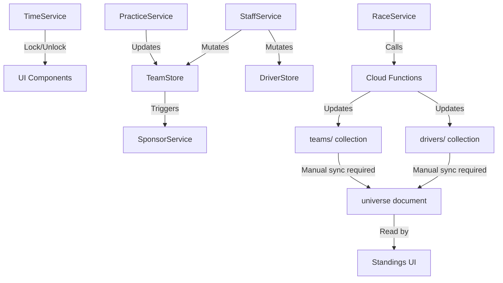

# AI Technical Specification: Service Registry & Interfaces

This document defines the interface and behaviors of core services for automated code generation and architectural reasoning.

## 1. Context: Time & Progress Orchestration
### `TimeService` (Singleton)
- **Timezone**: UTC-5 (Bogota, Colombia).
- **Phases**: `[practice, qualifying, raceStrategy, race, postRace]`.
- **Logic**:
  - `isSetupLocked`: `targetStatus IN [qualifying, raceStrategy, race]`.
  - `isPracticeActionLocked`: `qualifyingAttempts > 0 OR (Saturday >= 13:00 COT)`. 
  - `getRaceWeekStatus`: Monday 00:00 -> Sat 13:59 (Practice); Sat 14:00 (Qualy); Sat 15:00 (Strategy); Sun 14:00 (Race); Sun 16:00 (Post).

## 2. Business Entity Services
### `SponsorService`
- **Mutations**: `budget`, `team.sponsors`, `team.weekStatus.sponsorNegotiations`.
- **API**:
  - `getAvailableSponsors(slot, role, negotiations)`: Generates 3 random `SponsorOffer`.
  - `negotiate(teamId, offer, tactic, slot)`: Transactional. Success probability: `30% + (tactic == personality ? 50 : 0)`.
- **Dependencies**: `Firestore.runTransaction`, `SponsorPersonality` Enum.

### `StaffService`
- **Mutations**: `drivers.stats`, `team.budget`, `team.weekStatus`.
- **Critical Methods**:
  - `trainPilot(teamId, pilotId, bonus)`: Atomic increment of `driver.stats.fitness`. Max 100.
  - `dismissDriver(teamId, driver)`: Penalty: `10% market value`. Nullifies `driver.teamId`.
  - `listDriverOnMarket(teamId, driver)`: Listing fee (10% of market value) applied to `budget`. Sets `isTransferListed = true` and `transferListedAt`. Guard: at least 1 non-listed main driver must remain (enforced in UI).
  - `cancelListing(teamId, driver)`: Clears `isTransferListed` and `transferListedAt`. No refund of listing fee. Throws if `currentHighestBid > 0` (active bids block cancellation).

### `PracticeService` (Simulation Engine - Client)
- **Function**: `simulatePracticeRun(circuit, team, driver, setup)` -> `PracticeRunResult`.
- **Algorithm**: Deterministic lap time with Gaussian noise.
  - `Wet` Surface Penalty: `+1.5s` base.
  - Incorrect Tyre Penalty: `+8.0s` (if dry tyres in rain) or `+3.0s` (if wet tyres in dry).
- **Feedback Generation**: Derived from `setup_gap` vs `driver.feedback_skill`.
- **Setup Hints**: Generates dynamic visual ranges. High `feedback` stat = narrower ranges. **Qualy Ace specialty** simulates `feedbackStat + 0.35` boost → significantly tighter hints (better qualifying precision).
- **Qualifying Integration**: Per-driver `lastQualyResult` persists setup hints and allows fallback to `practice` results for managers to optimize during qualifying attempts.
- **State Writes**: Updates `weekStatus.driverSetups.{id}.practice` or `qualifying` for persistence. Stores `bestLapSetup` upon achieving a new personal best lap.

### `AcademyService`
- **Mutations**: `academy.config.candidates`, `academy.config.selected`.
- **API**:
  - `generateInitialCandidates(count, nation, level)`: Strictly returns 1M/1F pair with level-based stat scaling.
  - `saveCandidates(teamId, candidates)`: Batch persistent write.
- **Rules**: Protects recruited drivers by avoiding overwrites in existing subcollections.

## 3. System Administration
### `AdminService`
- **Capabilities**: Full reseed (`nuke`), calendar sync, global economic rebalancing.
- **Recovery Tools**:
  - `fixBrokenAcademies()`: Repairs teams with unlocked facilities but missing setup/candidates. Atomic sync of `config` document and initial batch.
- **Patterns**: High-performance batch writes (450 ops/chunk).

## 4. Cloud Functions — Weekend Event Pipeline

### Scheduler Table
| Export Name | Schedule | Action |
|---|---|---|
| `scheduledQualifying` | `0 15 * * 6` (Sat 15:00 COT) | `runQualifyingLogic()` |
| `scheduledRace` | `0 14 * * 0` (Sun 14:00 COT) | `runRaceLogic()` |
| `postRaceProcessing` | `*/30 * * * *` | Economy processing (fires when `postRaceProcessingAt` has passed) |
| `scheduledDailyFitnessRecovery` | `0 0 * * *` | +1.5 fitness to all active drivers |

### Critical Architecture: Universe Denormalization
- The `/season/standings` UI page reads from `universe/game_universe_v1` (a denormalized document).
- `runRaceLogic()` updates individual `drivers/{id}` and `teams/{id}` documents.
- **These are NOT the same.** The universe document requires an explicit sync step.
- **Script:** `node functions/sync_universe.js` (must be run after any manual race simulation).

### SimLapParams — Extended Interface (v1.4.0+)

```typescript
interface SimLapParams {
  circuit: Circuit;
  carStats: Partial<CarStats>;
  driverStats: Partial<DriverStats>;
  setup: Partial<CarSetup>;
  style?: string;
  teamRole?: string;
  weather?: string;
  specialty?: DriverSpecialty | string;  // NEW: driver's current specialty
  isQualifying?: boolean;               // NEW: true when called from qualifying
  fatigueLevel?: number;                // NEW: 0–100, current physical fatigue
}
```

**Specialty effects in `simulateLap`:**
| Specialty | Effect | Mechanism |
|---|---|---|
| Rainmaster | +speed in wet | `df -= RAINMASTER_WET_DF_BONUS` (wet only) |
| Late Braker | +speed | braking weight × (1 + LATE_BRAKER_STAT_BOOST) |
| Apex Hunter | +speed | cornering weight × (1 + APEX_HUNTER_STAT_BOOST) |
| Defensive Minister | fewer crashes | `accProb *= (1 - DEFENSIVE_MINISTER_CRASH_REDUCTION)` |
| Iron Nerve | less variance | noise scale × (1 - IRON_NERVE_NOISE_REDUCTION) |
| Qualy Ace | faster in qualifying | `lap *= (1 - QUALY_ACE_LAPTIME_BONUS)` when `isQualifying=true` |

**Fatigue model in `simulateRace`:**
- `fatigue[id]` initialized from `driver.stats.fitness` (0–100 scale)
- Per lap: `fatigue[id] -= FATIGUE_DRAIN_BY_STYLE[currentStyle]`
- `Iron Wall` specialty: drain skipped entirely
- `Tyre Whisperer`: wear accumulation × (1 - TYRE_WHISPERER_WEAR_REDUCTION)
- When `fatigue < FATIGUE_PENALTY_THRESHOLD`: `df *= (1 + (threshold - fatigue) * FATIGUE_PENALTY_FACTOR)`
- Fatigue floors at 0 (no DNF from fatigue, only performance penalty)

### Guard Conditions (CRITICAL)
```js
// Qualifying skip guard — MUST use .length > 0, NOT just existence
if (rSnap.data().qualyGrid?.length > 0) { continue; }

// Variables MUST be declared before conditional assignment (strict mode)
let extraCrash = 0; // REQUIRED before "if (teamRole === 'ex_driver') { extraCrash = ... }"
```

### Emergency Recovery Commands (from `functions/` dir)
```bash
node scripts/emergency/force_race_local.js qualy  # 1. Force qualifying
node scripts/emergency/force_race_local.js race   # 2. Force race (or force_race_wrapper.js)
node scripts/emergency/force_post_race.js         # 3. Force postRaceProcessing
node scripts/emergency/sync_universe.js           # 4. Sync denormalized universe document
```
> `reset_all.js` and `run_simulation.js` do not exist. Always use the paths above.

See full spec: [weekend_pipeline.md](weekend_pipeline.md)

## 5. Interaction Dependency Graph


## 6. Security & Transactional Integrity
- Use `runTransaction` for all budget mutations.
- Notification entries MUST be created within the same batch as the event that triggered them.
- Firebase Functions run in **strict mode**. Variables MUST be declared before use.

