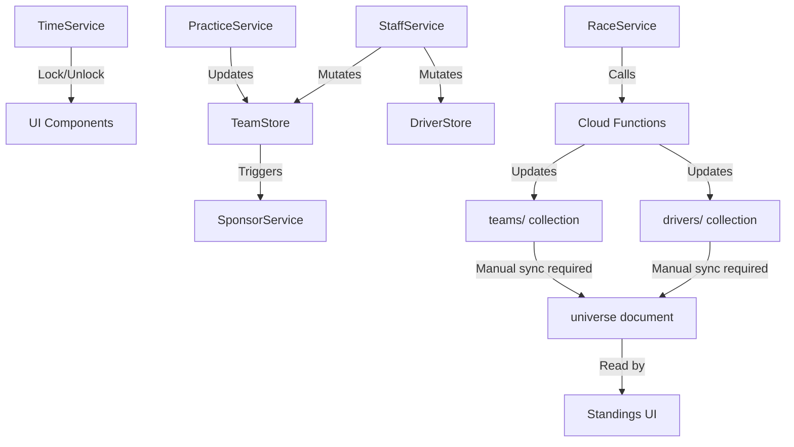

# AI Technical Specification: Service Registry & Interfaces

This document defines the interface and behaviors of core services for automated code generation and architectural reasoning.

## 1. Context: Time & Progress Orchestration
### `TimeService` (Singleton)
- **Timezone**: UTC-5 (Bogota, Colombia).
- **Phases**: `[practice, qualifying, raceStrategy, race, postRace]`.
- **Logic**:
  - `isSetupLocked`: `targetStatus IN [qualifying, raceStrategy, race]`.
  - `isPracticeActionLocked`: `qualifyingAttempts > 0 OR (Saturday >= 13:00 COT)`. 
  - `getRaceWeekStatus`: Monday 00:00 -> Sat 13:59 (Practice); Sat 14:00 (Qualy); Sat 15:00 (Strategy); Sun 14:00 (Race); Sun 16:00 (Post).

## 2. Business Entity Services
### `SponsorService`
- **Mutations**: `budget`, `team.sponsors`, `team.weekStatus.sponsorNegotiations`.
- **API**:
  - `getAvailableSponsors(slot, role, negotiations)`: Generates 3 random `SponsorOffer`.
  - `negotiate(teamId, offer, tactic, slot)`: Transactional. Success probability: `30% + (tactic == personality ? 50 : 0)`.
- **Dependencies**: `Firestore.runTransaction`, `SponsorPersonality` Enum.

### `StaffService`
- **Mutations**: `drivers.stats`, `team.budget`, `team.weekStatus`.
- **Critical Methods**:
  - `trainPilot(teamId, pilotId, bonus)`: Atomic increment of `driver.stats.fitness`. Max 100.
  - `dismissDriver(teamId, driver)`: Penalty: `10% market value`. Nullifies `driver.teamId`.
  - `listDriverOnMarket(teamId, driver)`: Listing fee (10% of market value) applied to `budget`. Sets `isTransferListed = true` and `transferListedAt`. Guard: at least 1 non-listed main driver must remain (enforced in UI).
  - `cancelListing(teamId, driver)`: Clears `isTransferListed` and `transferListedAt`. No refund of listing fee. Throws if `currentHighestBid > 0` (active bids block cancellation).

### `StaffService` — New methods (v1.5.0 Morale System)
- **`applyMoraleEvent(driverId, delta)`**: Applies morale delta to a driver, clamping to [0, 100]. Use for non-transactional morale events from external callers.
- **`boostMoralePsychologist(teamId, driverId, bonusPoints)`**: Manual psychologist session. Sets `psychologistSessionDoneThisWeek = true`. One per week.
- **`savePsychologistAssignment(teamId, { assignedToId })`**: Saves which driver the HR Manager/Psychologist is assigned to.
- **`changePsychologistLevel(teamId, newLevel, cost, isUpgrade)`**: Upgrades or downgrades psychologist level. Deducts `cost` from budget on upgrade. Sets `psychologistUpgradedThisWeek = true`.

### `PracticeService` (Simulation Engine - Client)
- **Function**: `simulatePracticeRun(circuit, team, driver, setup)` -> `PracticeRunResult`.
- **Algorithm**: Deterministic lap time with Gaussian noise.
  - `Wet` Surface Penalty: `+1.5s` base.
  - Incorrect Tyre Penalty: `+8.0s` (if dry tyres in rain) or `+3.0s` (if wet tyres in dry).
- **Feedback Generation**: Derived from `setup_gap` vs `driver.feedback_skill`.
- **Setup Hints**: Generates dynamic visual ranges. High `feedback` stat = narrower ranges. **Qualy Ace specialty** simulates `feedbackStat + 0.35` boost → significantly tighter hints (better qualifying precision).
- **Qualifying Integration**: Per-driver `lastQualyResult` persists setup hints and allows fallback to `practice` results for managers to optimize during qualifying attempts.
- **State Writes**: Updates `weekStatus.driverSetups.{id}.practice` or `qualifying` for persistence. Stores `bestLapSetup` upon achieving a new personal best lap.

### `AcademyService`
- **Mutations**: `academy.config.candidates`, `academy.config.selected`.
- **API**:
  - `generateInitialCandidates(count, nation, level)`: Strictly returns 1M/1F pair with level-based stat scaling.
  - `saveCandidates(teamId, candidates)`: Batch persistent write.
- **Rules**: Protects recruited drivers by avoiding overwrites in existing subcollections.

### `YouthAcademyStore` — T-004 additions
- **`runTraineePractice(traineeId, mainDriverId, result, setup, lapsCompleted)`**: Sends the marked trainee to the weekend practice session in place of the main driver.
  - Writes `lastPracticeRun` + XP + stat drain to `selected/{traineeId}`.
  - Writes setup to `weekStatus.driverSetups[mainDriverId].practice` so it flows into qualifying/race.
  - Sets `weekStatus.traineePracticeUsed = traineeId` on the team doc (team-level lock — prevents rotating multiple trainees).
  - **No budget mutation** — uses `updateDoc`, not `runTransaction`.
- **`traineePracticeUsed` (getter)**: Returns `teamStore.value.team?.weekStatus?.traineePracticeUsed ?? null`. Null = slot free.
- **Lock reset**: `traineePracticeUsed` is cleared in `postRaceProcessing` with the rest of `weekStatus`.
- **Trainee selection priority**: `isMarkedForPromotion` trainee is shown first in GaragePanel. If none marked, first in `selectedDrivers[]`.

## 3. System Administration
### `AdminService`
- **Capabilities**: Calendar sync, global economic rebalancing, qualifying recovery, academy repair.
- **`nukeAndReseed`**: Deprecated — removed from admin UI. Kept as emergency reference only.
- **Dry-Run Pattern (v1.5.1+)**: All destructive methods accept `dryRun?: boolean`. When `true`, all reads execute but no `batch.commit()` is called. Returns `AdminPreflightResult` instead of the normal result.

```typescript
interface AdminPreflightResult {
  affectedDocIds: string[];  // Full Firestore paths, e.g. "teams/abc123"
  summary: string;           // Human-readable, e.g. "8 teams · 14 drivers · 2 race docs"
}
```

- **Methods with dry-run support**:
  - `resetQualifyingSession(dryRun?)`: Scope — human teams with `qualifyingAttempts > 0` + unfinished races with `qualyGrid.length > 0`. Completed races (`isFinished=true`) are never touched.
  - `applyGreatRebalanceTax(dryRun?)`: Scope — all teams (human + bot). Adjusts budget, clears sponsors, resets sponsorNegotiations.
  - `fixBrokenAcademies(dryRun?)`: Scope — teams where `youthAcademy.level > 0` AND no active trainees in `selected` sub-collection.
- **CF tools with dry-run support** (`request.data.dryRun = true`):
  - `restoreDriversHistory`: Scope — all active drivers. Returns `{ dryRun: true, affectedDocIds, summary }` without committing.
  - `megaFixDebriefs`: Scope — all teams with drivers in leagues that have completed races. Returns `{ dryRun: true, affectedDocIds, summary }` without committing.
- **Scope guards**: Every method that iterates a collection has a `// SCOPE:` comment documenting exactly which documents it touches.
- **Patterns**: High-performance batch writes (450 ops/chunk). Two-phase UI flow: dry-run → pre-flight modal → confirmed execute.

## 4. Cloud Functions — Weekend Event Pipeline

### Scheduler Table
| Export Name | Schedule | Action |
|---|---|---|
| `scheduledQualifying` | `0 15 * * 6` (Sat 15:00 COT) | `runQualifyingLogic()` |
| `scheduledRace` | `0 14 * * 0` (Sun 14:00 COT) | `runRaceLogic()` |
| `postRaceProcessing` | `*/30 * * * *` | Economy processing (fires when `postRaceProcessingAt` has passed) |
| `scheduledDailyFitnessRecovery` | `0 0 * * *` | +1.5 fitness to all active drivers |

### Critical Architecture: Universe Denormalization
- The `/season/standings` UI page reads from `universe/game_universe_v1` (a denormalized document).
- `runRaceLogic()` updates individual `drivers/{id}` and `teams/{id}` documents.
- **These are NOT the same.** The universe document requires an explicit sync step.
- **Script:** `node functions/sync_universe.js` (must be run after any manual race simulation).

### SimLapParams — Extended Interface (v1.4.0+)

```typescript
interface SimLapParams {
  circuit: Circuit;
  carStats: Partial<CarStats>;
  driverStats: Partial<DriverStats>;
  setup: Partial<CarSetup>;
  style?: string;
  teamRole?: string;
  weather?: string;
  specialty?: DriverSpecialty | string;  // NEW: driver's current specialty
  isQualifying?: boolean;               // NEW: true when called from qualifying
  fatigueLevel?: number;                // NEW: 0–100, current physical fatigue
}
```

- `driverStats.morale` (0–100, default MORALE_DEFAULT=70): applied as `MORALE_LAPTIME_FACTOR * (morale - MORALE_NEUTRAL) / 100` added to the driver skill sum in driverFactor. Positive morale (> 50) reduces driverFactor (faster). Negative morale (< 50) increases driverFactor (slower). Range: ±1% at extremes.

**Specialty effects in `simulateLap`:**
| Specialty | Effect | Mechanism |
|---|---|---|
| Rainmaster | +speed in wet | `df -= RAINMASTER_WET_DF_BONUS` (wet only) |
| Late Braker | +speed | braking weight × (1 + LATE_BRAKER_STAT_BOOST) |
| Apex Hunter | +speed | cornering weight × (1 + APEX_HUNTER_STAT_BOOST) |
| Defensive Minister | fewer crashes | `accProb *= (1 - DEFENSIVE_MINISTER_CRASH_REDUCTION)` |
| Iron Nerve | less variance | noise scale × (1 - IRON_NERVE_NOISE_REDUCTION) |
| Qualy Ace | faster in qualifying | `lap *= (1 - QUALY_ACE_LAPTIME_BONUS)` when `isQualifying=true` |

**Fatigue model in `simulateRace`:**
- `fatigue[id]` initialized from `driver.stats.fitness` (0–100 scale)
- Per lap: `fatigue[id] -= FATIGUE_DRAIN_BY_STYLE[currentStyle]`
- `Iron Wall` specialty: drain skipped entirely
- `Tyre Whisperer`: wear accumulation × (1 - TYRE_WHISPERER_WEAR_REDUCTION)
- When `fatigue < FATIGUE_PENALTY_THRESHOLD`: `df *= (1 + (threshold - fatigue) * FATIGUE_PENALTY_FACTOR)`
- Fatigue floors at 0 (no DNF from fatigue, only performance penalty)

### Guard Conditions (CRITICAL)
```js
// Qualifying skip guard — MUST use .length > 0, NOT just existence
if (rSnap.data().qualyGrid?.length > 0) { continue; }

// Variables MUST be declared before conditional assignment (strict mode)
let extraCrash = 0; // REQUIRED before "if (teamRole === 'ex_driver') { extraCrash = ... }"
```

### Emergency Recovery Commands (from `functions/` dir)
```bash
node scripts/emergency/force_race_local.js qualy  # 1. Force qualifying
node scripts/emergency/force_race_local.js race   # 2. Force race (or force_race_wrapper.js)
node scripts/emergency/force_post_race.js         # 3. Force postRaceProcessing
node scripts/emergency/sync_universe.js           # 4. Sync denormalized universe document
```
> `reset_all.js` and `run_simulation.js` do not exist. Always use the paths above.

See full spec: [weekend_pipeline.md](weekend_pipeline.md)

## 5. Interaction Dependency Graph


---

## 5b. Parts Wear (T-007 Slice 2)

### `partsWearService` — `frontend/src/lib/services/parts_wear_service.svelte.ts`

Stateless service. All Firestore mutations go through `runTransaction`.

| Method | Signature | Description |
|---|---|---|
| `seedEngineIfMissing` | `(teamId, carIndex) => Promise<void>` | No-ops if `parts/engine` doc already exists. Safe to call on every page load. |
| `getGarageRepairTarget` | `(teamData) => number` | Returns repair ceiling (65–100) from `facilities.garage.level`. Clamps 1–5. |
| `getRepairCap` | `(teamData) => number` | Returns per-round repair budget cap scaled by `facilities.hq.level`. Formula: `$150k × (1 + (hqLevel-1) × 0.5)`. |
| `repairPart` | `(teamId, carIndex, partType, repairCost?) => Promise<void>` | Atomically repairs a part. Sets `condition = maxCondition = getGarageRepairTarget`. Sets `repairCooldownRoundsLeft = 2`. Enforces `INSUFFICIENT_BUDGET` and `REPAIR_BUDGET_EXCEEDED` (cap doubles on `isLastRound`). |
| `repairTarget` | `(part: Part) => number` | Returns `part.maxCondition`. Use in UI to show post-repair target. |
| `getRemainingRepairBudget` | `(team: Team) => number` | Cap (scaled by HQ, doubled on final round) minus `weekStatus.repairSpentThisRound`. Pure. |
| `getConditionTier` | `(condition: number) => ConditionTier` | Pure. Maps 0–100 to `'green'|'yellow'|'orange'|'red'` using `PARTS_TIER_THRESHOLDS`. |

**Transaction guarantees:** `repairPart` reads budget and `repairSpentThisRound` inside the transaction. Rolls back atomically on either check failure.

**Repair lock:** `timeService.isRepairLocked` is true from Saturday 13:00 COT through Sunday post-race (until Monday 00:00). UI disables the repair button; backend has no lock enforcement.

**Error tokens:** `'INSUFFICIENT_BUDGET'` (team funds), `'REPAIR_BUDGET_EXCEEDED'` (round cap).

**Error namespace:** `[PartsWearService:repairPart]`

---

### `partsStore` — `frontend/src/lib/stores/parts.svelte.ts`

Reactive singleton. Subscribes to `teams/{teamId}/cars/{carIndex}/parts/` via `onSnapshot`.

| Member | Type | Description |
|---|---|---|
| `init(teamId, carIndex)` | `() => () => void` | Starts Firestore listener. Returns cleanup for `$effect`. Gated behind `browser` + `authStore.user`. |
| `enginePart` | `Part \| null` | Reactive getter for the engine part doc (backward compat). |
| `getPart(partType)` | `Part \| null` | Returns a single part doc by type. `null` for un-migrated teams. |
| `allParts` | `Part[]` | All part docs that currently exist for this car (0–6 entries). |
| `getCondition(partId)` | `number` | Part condition (0–100). Defaults to 100 if doc missing (COMPAT-1). |
| `getTier(partId)` | `ConditionTier` | Delegates to `partsWearService.getConditionTier`. |
| `hasAnyWornPart(tier)` | `boolean` | `true` if any part is at or below the given tier. `'orange'` matches orange + red; `'red'` matches red only. Used by StrategyPanel banner. |
| `carConditionPct` | `number` | Average condition of all loaded parts, rounded. Returns 100 when no parts exist. Used in Engineering page header and StrategyPanel banner. |
| `carConditionTier` | `ConditionTier` | Tier derived from `carConditionPct`. |
| `repairSpentThisRound` | `number` | Read-only. Reads from `teamStore.value.team.weekStatus.repairSpentThisRound`. Reactive. |

**Usage rule:** Components read only via `partsStore` getters. Direct Firestore calls from `.svelte` files are forbidden (CLAUDE.md §4.2).

---

## 5c. Season Lifecycle (T-124 Slice 1)

### `seasonStore` — `frontend/src/lib/stores/season.svelte.ts`

Reactive singleton. Subscribes to the active `seasons/{seasonId}` document via `onSnapshot`.

| Member | Type | Description |
|---|---|---|
| `value` | `{ season: Season \| null, loading: boolean }` | Raw reactive state. Access via getters where possible. |
| `nextEvent` | `CalendarRace \| null` | First calendar entry where `isCompleted !== true`. |
| `isSeasonEnded` | `boolean` | `true` when `season.status === "ended"`. Gate all season-end UI behind this. |
| `isPreSeason` | `boolean` | `true` when `season.status === "preseason"`. Reserved for S6 (pre-season phase). |

**`isSeasonEnded` gate priority:** Components must check `seasonStore.isSeasonEnded` BEFORE any time-based status switch (e.g., `weekStatus` derived from `timeService`). The season-end state always overrides the weekly schedule.

**`seasons/{id}.status` valid values:**
| Value | Meaning |
|---|---|
| `"active"` (default / absent) | Season in progress |
| `"ended"` | Last race processed; prize distribution complete |
| `"preseason"` | Pre-season phase active (S6) |

### `universeStore` — `frontend/src/lib/stores/universe.svelte.ts`

Reactive singleton. Subscribes to `universe/game_universe_v1` via `onSnapshot`. Idempotent `init()` — safe to call from multiple pages.

| Member | Type | Description |
|---|---|---|
| `value.universe` | `GameUniverse \| null` | Raw universe snapshot. Contains `leagues[]`. |
| `value.loading` | `boolean` | `true` until first snapshot resolves. |
| `init()` | `void` | Starts the `onSnapshot` listener. No-op if already subscribed. Call from dashboard and standings page. |
| `getLeagueByTeamId(teamId)` | `League \| null` | Returns the league object containing the given team. |
| `getTeamStanding(teamId)` | `{ position, total, points }` | Single-team position in their league. |
| `getAllTeamStandings(teamId)` | `Array<{...team, position}>` | All teams in the player's league, sorted by `seasonPoints` desc, with 1-based `position`. Added in T-124 S2. |
| `getDriversChampion(teamId)` | `DriverRecord \| null` | Top driver in player's league. Tie-break: pts → wins → podiums → id asc. Added in T-124 S2. |
| `getDriverStandings(teamId)` | `DriverRecord[]` | Drivers for the player's team only. |
| `getDriverById(driverId)` | `DriverRecord \| null` | Finds driver across all leagues. |

**Frontend constants:** `frontend/src/lib/constants/season.ts` — `SEASON_PRIZE_TABLE` (10-element array, index 0 = P1) and `DRIVERS_CHAMPION_TEAM_BONUS`. Mirror the CF constants. Do not hardcode prize amounts in components.

### `runSeasonEndProcessing` — `functions/lib/domains/economy/season-end.js`

See **Phase 3b** in `weekend_pipeline.md` for the full execution sequence. Called non-fatally from `postRaceProcessing` after the per-team economy loop, once per season lifecycle.

**Pure helpers (TypeScript source, fully unit-tested):** `functions/src/domains/economy/season-end.ts`
- `getSeasonPrizeForPosition(position: number): number` — returns prize amount for 1-indexed position
- `rankTeamsByPoints(teams): RankedTeam[]` — stable sort: pts desc → wins desc → podiums desc → id asc
- `findDriversChampion(drivers): DriverRecord | null` — same tie-break order

---

## 6. Security & Transactional Integrity
- Use `runTransaction` for all budget mutations.
- Notification entries MUST be created within the same batch as the event that triggered them.
- Firebase Functions run in **strict mode**. Variables MUST be declared before use.

---
