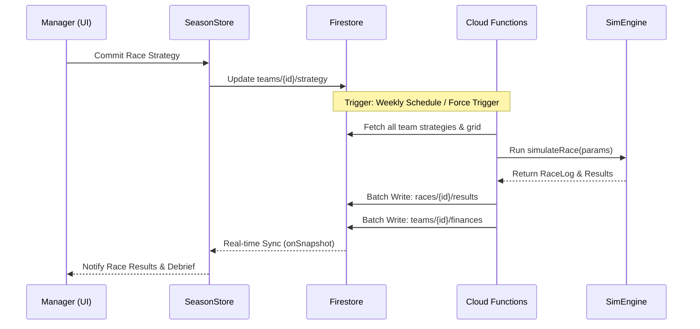

# Arquitectura del Sistema (Nivel Senior)

## 1. Blueprint Arquitectónico
El sistema emplea una arquitectura **Serverless Event-Driven** distribuida entre una SPA (SvelteKit) y un core de procesamiento asíncrono (Firebase Functions).

### Diagrama de Flujo de Datos (Carrera)


## 2. Gestión de Identidad y Onboarding
El acceso al sistema está regido por un flujo de redirección reactivo en `+layout.svelte` que actúa como una máquina de estados de seguridad.

```mermaid
graph TD
    A[Login] --> B{Auth Firebase?}
    B -- No --> A
    B -- Sí --> C{¿Perfil Manager?}
    C -- No --> D[/onboarding/create-manager]
    C -- Sí --> E{¿Equipo Asignado?}
    E -- No --> F[/onboarding/team-selection]
    E -- Sí --> G[Dashboard]
```

## 3. Stack Tecnológico & Justificación
*   **Frontend**: Svelte 5 (Runes). Reactividad granular mediante `$state` y `$derived`.
*   **Backend**: Node.js 20 (Firebase Functions v2). Escalado horizontal automático.
*   **Persistencia**: Firestore NoSQL. Estructura optimizada para "Universe Data".
*   **Testing**: Vitest para unit testing de lógica de negocio y Playwright (en fase de implementación) para E2E.

## 3. Patrones de Diseño Implementados
### A. Reactive Store-Service Pattern
Los **Stores** (`src/lib/stores`) actúan como orquestadores de estado y suscriptores de Firestore. Los **Servicios** (`src/lib/services`) son stateless y gestionan la comunicación pura con Firebase.
*   **Ventaja**: Desacoplamiento total de la lógica de persistencia y la UI.

### B. Optimistic UI & Atomic Transactions
Para el mercado de transferencias, se utilizan transacciones atómicas de Firestore para evitar condiciones de carrera en subastas concurrentes.

## 4. Estrategia de Sincronización
El estado global del "Universo" se gestiona mediante un único punto de verdad en Firestore, con listeners reactivos que minimizan el uso de red mediante el sistema de offsets y caché local de Firebase.

## 5. DevOps y Mantenimiento
*   **Estrategia de Despliegue**: Basada en Firebase Hosting para el frontend y Cloud Functions para el backend. Se recomienda la migración a GitHub Actions para automatizar el ciclo de vida (CI/CD).
*   **Internationalization (i18n)**: Actualmente no formalizada. La lógica de negocio utiliza strings en inglés por defecto con adaptaciones puntuales. Se propone `svelte-i18n` como mejora de arquitectura.
*   **Security Performance Audit (Hallazgos)**:
    *   **Firestore Rules**: Actualmente configuradas con permisos amplios. Se recomienda restringir a **RBAC** mediante `request.auth.token.role`.
    *   **Cold Starts**: Configurado `maxInstances: 10` para minimizar la latencia.

## 6. Auditoría de Deuda Técnica y Recomendaciones
Tras el análisis exhaustivo, se identifican las siguientes áreas de mejora para alcanzar el estándar "Enterprise":
1.  **Observabilidad**: Falta un sistema de logging centralizado (ej. Sentry o Google Cloud Logging) para capturar errores en producción.
2.  **Manejo de Errores UX**: Ausencia de una página de error global (`+error.svelte`) que gestione fallos de red o de permisos de Firestore de forma elegante.
3.  **Localización Estructural**: Se recomienda migrar los strings hardcodeados a un sistema de diccionarios (JSON) para soportar múltiples idiomas sin duplicación de código.
4.  **Pipeline CI/CD**: El despliegue manual es un riesgo de seguridad y consistencia. Es crítica la implementación de una pipeline que ejecute `npm run test` antes de cada deploy.

---

## 7. Guía de Implementación (Roadmap Técnico)

### A. Implementación de Observabilidad (Sentry)
1.  **Instalación**: `npm install @sentry/sveltekit`.
2.  **Configuración**:
    *   Crear `src/hooks.client.ts` y `src/hooks.server.ts`.
    *   Inicializar Sentry con el DSN del proyecto.
3.  **Uso**: Envolver el manejador de SvelteKit en el servidor para capturar excepciones de Cloud Functions erróneas.

### B. Manejo de Errores Global (UX)
1.  **Archivo**: Crear `src/routes/+error.svelte`.
2.  **Lógica**:
    ```svelte
    <script>
      import { page } from '$app/stores';
    </script>
    <div class="error-container">
      <h1>{$page.status}: {$page.error?.message}</h1>
      <button onclick={() => history.back()}>Volver al Pit</button>
    </div>
    ```
3.  **Estilo**: Aplicar el diseño premium de la aplicación (`app-surface`, `text-app-primary`).

### C. Automatización de CI/CD (GitHub Actions)
1.  **Workflow**: Crear `.github/workflows/deploy.yml`.
2.  **Jobs**:
    *   `build_and_test`: Ejecuta `npm install` y `npm run test`.
    *   `deploy`: Si los tests pasan, ejecuta `firebase deploy --only hosting,functions`.
3.  **Secrets**: Configurar `FIREBASE_SERVICE_ACCOUNT` en los secretos de GitHub.
